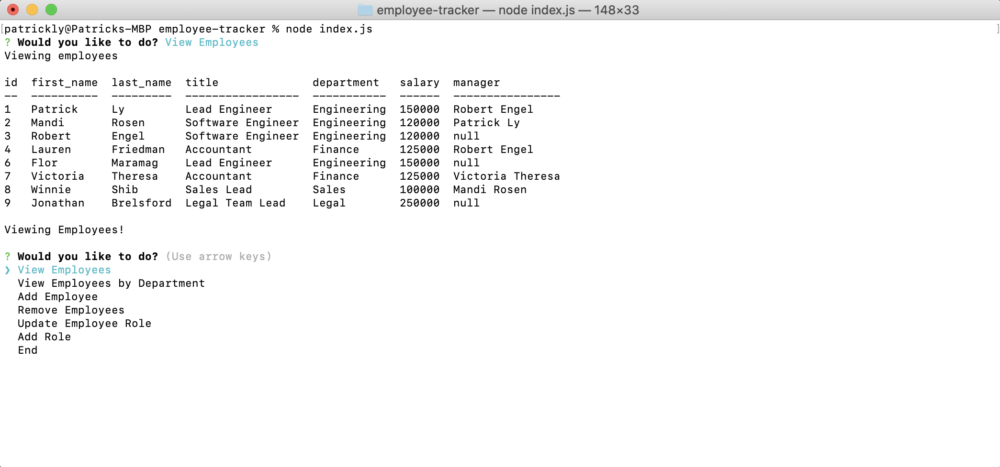

# Employee-Tracker
[](https://opensource.org/licenses/MIT)
## Table of contents
1. [Description](#description)
2. [Installation](#installation)
3. [Usage](#usage)
4. [Contributing](#contributing)
5. [License](#license)
6. [Technology](#technology)
7. [Screenshot](#screenshot)
8. [Links](#links)
    
<a name="descriptipn"></a>
## Description
The purpose of this application is to keep track of employees, department, and roles. As a user, you can choose to view employees, add employees, remove employees, and also update roles and add roles as well. This application uses MySQL, and Inquirer to run in the terminal. 
    
<a name="installation"></a>
## Installation
1. Load the database by running schema.sql 
2. seed the database by running seed.sql 
3. install the necessary dependencies by running npm install 
4. in the terminal, navigate to the application directory and run the application by typing in ```node index.js```
    
<a name="usage"></a>
## Usage
Follow the onscreen prompts in the terminal
    
<a name="license"></a>
## License
[](https://opensource.org/licenses/MIT)

<a name="technology"></a>
## Technology
1. Javascript
2. Node.js
3. Inquirer
4. MySQL

<a name="screenshot"></a>
## Screenshot

    
<a name="links"></a>
## Links
1. [GitHub](www.github.com/pattymcpat)
2. [Video](https://youtu.be/YIuqrtS6TEw)
